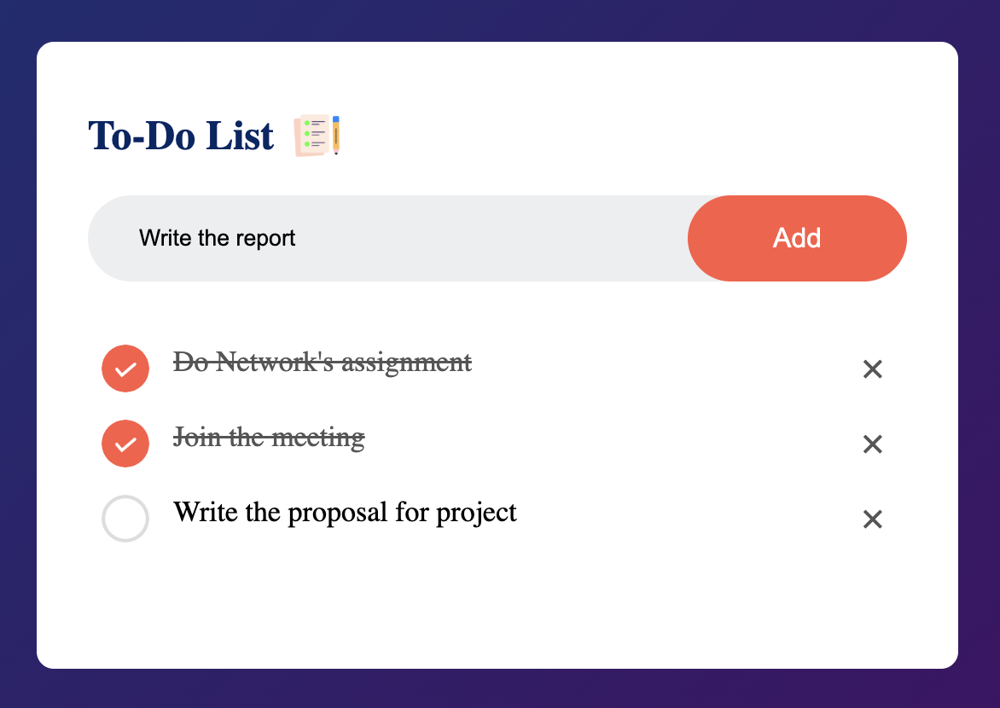

# 📝 To-Do List Web App

A simple task management web application that allows users to add, complete, and delete tasks in a dynamic to-do list.

## 🚀 Features

- ➕ Add new tasks  
- ✅ Mark tasks as completed  
- 🗑️ Delete individual tasks  
- 📄 All actions handled dynamically via JavaScript

## 📸 Screenshots

### View app

## 🛠️ Tech Stack

- HTML
- CSS
- JavaScript
